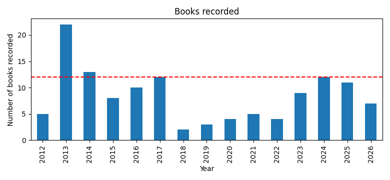
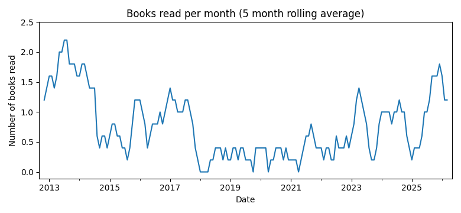
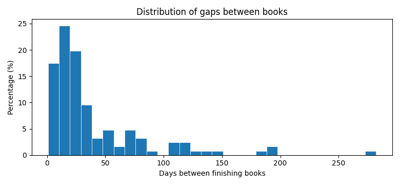

# Literature log

I started this log on October 30th, 2012. I list all books I read.  

### Statistics
Total number of books read: 125  
Books per month: 0.77 (2012/9 to 2026/3)

### List of books
*[Betrayer (Horus Heresy 24)](https://openlibrary.org/works/OL21062766W)*, Aaron Dembski-Bowden  
Finished: 2026.03.02

*[Know No Fear (Horus Heresy 19)](https://openlibrary.org/works/OL22836770W)*, Dan Abnett  
Finished: 2026.02.19

*[The First Heretic (Horus Heresy 14)](https://openlibrary.org/works/OL17511426W)*, Aaron Dembski-Bowden  
Finished: 2026.02.09

*[Fulgrim (Horus Heresy 5)](https://openlibrary.org/works/OL30246458W)*, Graham McNeill  
Finished: 2026.01.26

*[The flight of the Eisenstein (Horus Heresy 4)](https://openlibrary.org/works/OL25412022W)*, James Swallow  
Finished: 2026.01.07

*[Galaxy in Flames (Horus Heresy 3)](https://openlibrary.org/works/OL20773550W)*, Ben Counter  
Finished: 2025.12.30

*[False Gods (Horus Heresy 2)](https://openlibrary.org/works/OL3990207W)*, Graham McNeill  
Finished: 2025.11.28

*[Breath](https://openlibrary.org/works/OL20799952W)*, James Nestor  
Finished: 2025.11.17

*[Horus rising (Horus Heresy 1)](https://openlibrary.org/works/OL5843391W)*, Dan Abnett  
Finished: 2025.10.30

*[Turn the ship around!](https://openlibrary.org/works/OL20716172W)*, L. David Marquet  
Finished: 2025.10.24

*[Quantentheorie und Philosophie (Reclam)](https://openlibrary.org/works/OL326392W)*, Werner Heisenberg  
Finished: 2025.09.07

*[Der Sandmann](https://openlibrary.org/works/OL20272962W)*, E.T.A. Hoffmann  
Finished: 2025.08.29

*[You're the boss](https://openlibrary.org/works/OL42426692W)*, Sabina Nawaz  
Finished: 2025.08.13

*[Creatures of light and darkness](https://openlibrary.org/works/OL13964W)*, Roger Zelazny  
Finished: 2025.07.27

*[The Almanack of Naval Ravikant](https://openlibrary.org/works/OL22255847W)*, Eric Jorgenson  
Finished: 2025.05.05

*[Rewired](https://openlibrary.org/works/OL35712274W)*, Eric Lamarre, Kate Smaje, Rodney Zemmel  
Finished: 2025.04.25

*[Fundamentals of Data Engineering](https://openlibrary.org/works/OL27850217W)*, Joe Reis, Matt Housley  
Finished: 2024.12.25

*[Caliban's war](https://openlibrary.org/works/OL16117275W)*, James S. A. Corey  
Finished: 2024.10.03

*[Leviathan wakes](https://openlibrary.org/works/OL16114008W)*, James S. A. Corey  
Finished: 2024.09.14

*[Cracking the PM interview](https://openlibrary.org/works/OL17546046W)*, Gayle McDowell, Jackie Bavaro  
Finished: 2024.08.25

*[A fire upon the deep](https://openlibrary.org/works/OL1975714W)*, Vernor Vinge  
Finished: 2024.08.18

*[Neuromancer](https://openlibrary.org/works/OL27258W)*, William Gibson  
Finished: 2024.07.20

*[The left hand of darkness](https://openlibrary.org/works/OL59800W)*, Ursula K. Le Guin  
Finished: 2024.06.16

*[The rise of Endymion](https://openlibrary.org/works/OL1963248W)*, Dan Simmons  
Finished: 2024.04.29

*[Endymion](https://openlibrary.org/works/OL1963279W)*, Dan Simmons  
Finished: 2024.03.27

*[The Fall of Hyperion](https://openlibrary.org/works/OL1963251W)*, Dan Simmons  
Finished: 2024.02.23

*[Hyperion](https://openlibrary.org/works/OL1963268W)*, Dan Simmons  
Finished: 2024.02.07

*[The day the world stops shopping](https://openlibrary.org/works/OL24205357W)*, J.B. Mackinnon  
Finished: 2024.01.25

*[Snow Crash](https://openlibrary.org/works/OL38501W)*, Neal Stephenson  
Finished: 2023.11.13

*[Dune: Chapterhouse](https://openlibrary.org/works/OL893508W)*, Frank Herbert  
Finished: 2023.06.27

*[Heretics of Dune](https://openlibrary.org/works/OL893502W)*, Frank Herbert  
Finished: 2023.06.10

*[Digital Minimalism](https://openlibrary.org/works/OL19541830W)*, Cal Newport  
Finished: 2023.05.19

*[God emperor of Dune](https://openlibrary.org/works/OL893515W)*, Frank Herbert  
Finished: 2023.05.05

*[Children of Dune](https://openlibrary.org/works/OL893516W)*, Frank Herbert  
Finished: 2023.04.15

*[Dune: Messiah](https://openlibrary.org/works/OL893526W)*, Frank Herbert  
Finished: 2023.03.16

*[Deep Work](https://openlibrary.org/works/OL17713267W)*, Cal Newport  
Finished: 2023.02.17

*[Die Brüder Löwenherz](https://openlibrary.org/works/OL29884822W)*, Astrid Lindgren  
Finished: 2023.01.21

*[Good Omens](https://openlibrary.org/works/OL453936W)*, Neil Gaiman, Terry Pratchett  
Finished: 2022.09.24

*[How to change your mind](https://openlibrary.org/works/OL20159801W)*, Michael Pollan  
Finished: 2022.09.01

*The lion tracker's guide to life*, Boyd Varty  
Finished: 2022.05.03

*[The body keeps the score](https://openlibrary.org/works/OL18147687W)*, Bessel van der Kolk  
Finished: 2022.02.12

*[The Three-Body Problem](https://openlibrary.org/works/OL17610507W)*, Liu Cixin  
Finished: 2021.11.22

*Eleventh hour CISSP: Study guide*, Eric Conrad, Seth Misenar, Joshua Feldman  
Finished: 2021.09.26

*[Trotzdem Ja zum Leben sagen](https://openlibrary.org/works/OL43423433W)*, Viktor Frankl  
Finished: 2021.08.17

*[Radical Acceptance](https://openlibrary.org/works/OL15844781W)*, Tara Brach  
Finished: 2021.07.31

*[Von der Kürze des Lebens](https://openlibrary.org/works/OL40850803W)*, Seneca  
Finished: 2021.01.15

*[Bobby Fischer teaches chess](https://openlibrary.org/works/OL6572297W)*, Fischer, Margulies, Mosenfelder  
Finished: 2020.09.13

*[The checklist manifesto](https://openlibrary.org/works/OL15436462W)*, Atul Gawande  
Finished: 2020.07.17

*The Good Parts of AWS*, Josh Pschorr, Daniel Vassallo  
Finished: 2020.01.10

*[Ultralearning](https://openlibrary.org/works/OL20846121W)*, Scott H. Young  
Finished: 2020.01.06

*[A Game of Thrones](https://openlibrary.org/works/OL257943W)*, George R. R. Martin  
Finished: 2019.07.10

*Rausch der Verwandlung*, Stefan Zweig  
Finished: 2019.04.26

*[Dune](https://openlibrary.org/works/OL893415W)*, Frank Herbert  
Finished: 2019.01.05

*[Yquem](https://openlibrary.org/works/OL200495W)*, Richard Olney  
Finished: 2018.09.21

*5時に帰るドイツ人、5時から頑張る日本人*, 熊谷 徹  
Finished: 2018.07.24

*[Sterben](https://openlibrary.org/works/OL44648551W)*, Arthur Schnitzler  
Finished: 2017.10.15

*Meine Schwangerschaft - Tag für Tag*, Gabriele Grünebaum, Dr. Med. Loay Okko  
Finished: 2017.09.23

*[High Output Management](https://openlibrary.org/works/OL2355834W)*, Andrew S. Grove  
Finished: 2017.08.28

*Baby Betriebsanleitung*, Joe Borgenicht, Dr. Louis Borgenicht  
Finished: 2017.08.13

*Das große Buch für Babys erstes Jahr*, Dr. med. Stephan Nolte, Annette Nolden  
Finished: 2017.07.02

*[The Pyramid Principle](https://openlibrary.org/works/OL3012477W)*, Barbara Minto  
Finished: 2017.06.11

*[The Management Myth](https://openlibrary.org/works/OL3295236W)*, Matthew Stewart  
Finished: 2017.05.24

*Astrophysics: A Very Short Introduction*, James Binney  
Finished: 2017.03.28

*[How Google works](https://openlibrary.org/works/OL17276241W)*, Eric Schmidt, Jonathan Rosenberg  
Finished: 2017.03.08

*[Dogs and Demons](https://openlibrary.org/works/OL2511387W)*, Alex Kerr  
Finished: 2017.02.14

*[Windows On The World Complete Wine Course](https://openlibrary.org/works/OL83685W)*, Kevin Zraly  
Finished: 2017.01.31

*[Die Räuber](https://openlibrary.org/works/OL207633W)*, Friedrich Schiller  
Finished: 2017.01.18

*[Schachnovelle](https://openlibrary.org/works/OL28429W)*, Stefan Zweig  
Finished: 2016.12.15

*Mann und Vater sein*, Jesper Juul  
Finished: 2016.11.23

*[Flucht in die Finsternis](https://openlibrary.org/works/OL61390W)*, Arthur Schnitzler  
Finished: 2016.10.22

*[Spiel im Morgengrauen](https://openlibrary.org/works/OL61399W)*, Arthur Schnitzler  
Finished: 2016.08.14

*[The 4-hour work week](https://openlibrary.org/works/OL3353439W)*, Tim Ferriss  
Finished: 2016.07.28

*[Reigen](https://openlibrary.org/works/OL61422W)*, Arthur Schnitzler  
Finished: 2016.07.11

*[Momo](https://openlibrary.org/works/OL35111538W)*, Michael Ende  
Finished: 2016.05.24

*[Surely you're joking, Mr. Feynman!](https://openlibrary.org/works/OL514629W)*, Richard Feynman  
Finished: 2016.02.06

*[The Old Man and the Sea](https://openlibrary.org/works/OL63073W)*, Ernest Hemingway  
Finished: 2016.01.22

*The Monocle Guide to Good Business*, Monocle  
Finished: 2016.01.11

*[Prelude to mathematics](https://openlibrary.org/works/OL1201943W)*, Walter W. Sawyer  
Finished: 2015.12.27

*[Getting things done](https://openlibrary.org/works/OL271504W)*, David Allen  
Finished: 2015.12.17

*[Accounting for Dummies](https://openlibrary.org/works/OL1995294W)*, John A. Tracy  
Finished: 2015.11.30

*[An Introduction to Global Financial Markets](https://openlibrary.org/works/OL3041039W)*, Stephen Valdez  
Finished: 2015.09.23

*[The Search for Modern China](https://openlibrary.org/works/OL1842805W)*, Jonathan D. Spence  
Finished: 2015.05.03

*[Zero to One](https://openlibrary.org/works/OL17078706W)*, Peter Thiel  
Finished: 2015.04.15

*Harvard Business Review - 10 Must Reads on Leadership*, Various  
Finished: 2015.03.08

*[Notebooks of the Mind](https://openlibrary.org/works/OL114269W)*, Vera John-Steiner  
Finished: 2015.01.10

*[Corporate Fraud](https://openlibrary.org/works/OL20337578W)*, Maryam Hussain  
Finished: 2014.12.17

*[Getting to Yes](https://openlibrary.org/works/OL1837566W)*, William Ury, Roger Fisher  
Finished: 2014.09.15

*[The Power of a Positive No](https://openlibrary.org/works/OL450495W)*, William Ury  
Finished: 2014.08.18

*[Heart of Darkness](https://openlibrary.org/works/OL38663W)*, Joseph Conrad  
Finished: 2014.06.05

*[The Crucible](https://openlibrary.org/works/OL66347W)*, Arthur Miller  
Finished: 2014.05.28

*[Der Richter und sein Henker](https://openlibrary.org/works/OL8584542W)*, Friedrich Dürrenmatt  
Finished: 2014.05.26

*[Crashkurs](https://openlibrary.org/works/OL24577842W)*, Dirk Müller  
Finished: 2014.05.08

*[How animals work](https://openlibrary.org/works/OL1594765W)*, Knut Schmidt-Nielsen  
Finished: 2014.05.05

*Eine kurze Geschichte des Abendlandes in 12 Bauwerken*, Edward Hollis  
Finished: 2014.04.25

*[A random walk down Wall Street](https://openlibrary.org/works/OL2000283W)*, Burton G. Malkiel  
Finished: 2014.03.21

*[The (mis)behaviour of markets](https://openlibrary.org/works/OL1808383W)*, Benoit Mandelbrot  
Finished: 2014.02.24

*Fabian - Die Geschichte eines Moralisten*, Erich K&auml;stner  
Finished: 2014.01.17

*[The Mathematician's Mind](https://openlibrary.org/works/OL1209467W)*, Jacques Hadamard  
Finished: 2014.01.04

*Wie soll man leben?*, Marc Aurel/Anton Cechov  
Finished: 2013.12.31

*[On Truth](https://openlibrary.org/works/OL1829529W)*, Harry G. Frankfurt  
Finished: 2013.12.30

*[On Bullshit](https://openlibrary.org/works/OL1829528W)*, Harry G. Frankfurt  
Finished: 2013.12.28

*[Lust, Caution](https://openlibrary.org/works/OL7280135W)*, Eileen Chang  
Finished: 2013.12.06

*[The Road](https://openlibrary.org/works/OL40873W)*, Cormac McCarthy  
Finished: 2013.10.12

*[Der Idiot](https://openlibrary.org/works/OL31212219W)*, Fyodor Dostoyevsky  
Finished: 2013.09.29

*[Dreams of a final theory](https://openlibrary.org/works/OL16041739W)*, Steven Weinberg  
Finished: 2013.09.07

*[The Creative Habit](https://openlibrary.org/works/OL4290705W)*, Twyla Tharp  
Finished: 2013.08.09

*[Bartleby, the Scrivener: a Story of Wall Street](https://openlibrary.org/works/OL26683590W)*, Herman Melville  
Finished: 2013.08.02

*[Rich dad, poor dad](https://openlibrary.org/works/OL2010879W)*, Robert Kiyosaki  
Finished: 2013.07.30

*[How to stop worrying and start living](https://openlibrary.org/works/OL1063338W)*, Dale Carnegie  
Finished: 2013.07.27

*[How to win friends and influence people](https://openlibrary.org/works/OL1063267W)*, Dale Carnegie  
Finished: 2013.07.20

*[Screw it - Let's do it](https://openlibrary.org/works/OL802898W)*, Richard Branson  
Finished: 2013.07.01

*JavaScript: The Good Parts*, Douglas Crockford  
Finished: 2013.06.10

*Das f&uuml;nfte Buch*, Alexander Kluge  
Finished: 2013.06.18

*[Agile Software Development with Scrum](https://openlibrary.org/works/OL21375438W)*, Ken Schwaber, Mike Beedle  
Finished: 2013.05.15

*Quiet: The Power of Introverts in a World that can't stop talking*, Susan Cain  
Finished: 2013.04.12

*Gestatten: Elite*, Julia Friedrichs  
Finished: 2013.03.22

*[Traumnovelle](https://openlibrary.org/works/OL61384W)*, Arthur Schnitzler  
Finished: 2013.03.05

*[Coffee Life in Japan](https://openlibrary.org/works/OL16117557W)*, Merry White  
Finished: 2013.02.13

*[An Introduction to Japanese Society](https://openlibrary.org/works/OL3284505W)*, Yoshio Sugimoto  
Finished: 2013.02.03

*Das trunkene Land: Erzählungen*, Lu Xun  
Finished: 2013.01.14

*死ぬかと思った*, 林 雄司  
Finished: 2012.12.26

*[Tsukiji: The Fish Market at the Center of the World](https://openlibrary.org/works/OL19340610W)*, Theodore C. Bestor  
Finished: 2012.11.28

*Love in a fallen city: And other stories*, Eileen Chang  
Finished: 2012.12.31

*[The Cambridge Illustrated History of China](https://openlibrary.org/works/OL13537580W)*, Patricia Buckley Ebrey  
Finished: 2012.10.29

*[An Interpretive Introduction to Quantum Field Theory](https://openlibrary.org/works/OL3475733W)*, Paul Teller  
Finished: 2012.09.14

