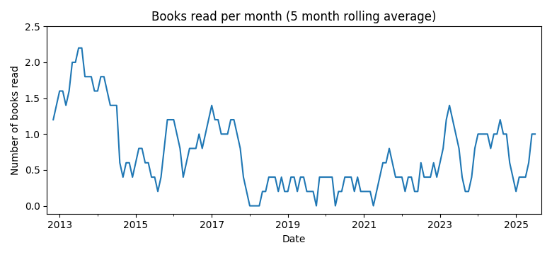

# Literature log

I started this log on October 30th, 2012. I list all books I read.

### Statistics
Total number of books read: 74  
Books per month: 0.93 (2012/9 to 2019/4)

### List of books
b'*Rausch der Verwandlung*, Stefan Zweig  '
Finished: 2019.04.26

b'*Dune*, Frank Herbert  '
Finished: 2019.01.05

b'*Yquem*, Richard Olney  '
Finished: 2018.09.21

b'*5\xe6\x99\x82\xe3\x81\xab\xe5\xb8\xb0\xe3\x82\x8b\xe3\x83\x89\xe3\x82\xa4\xe3\x83\x84\xe4\xba\xba\xe3\x80\x815\xe6\x99\x82\xe3\x81\x8b\xe3\x82\x89\xe9\xa0\x91\xe5\xbc\xb5\xe3\x82\x8b\xe6\x97\xa5\xe6\x9c\xac\xe4\xba\xba*, \xe7\x86\x8a\xe8\xb0\xb7 \xe5\xbe\xb9  '
Finished: 2018.07.24

b'*Sterben*, Arthur Schnitzler  '
Finished: 2017.10.15

b'*Meine Schwangerschaft - Tag f\xc3\xbcr Tag*, Gabriele Gr\xc3\xbcnebaum, Dr. Med. Loay Okko  '
Finished: 2017.09.23

b'*High Output Management*, Adrew S. Grove  '
Finished: 2017.08.28

b'*Baby Betriebsanleitung*, Joe Borgenicht, Dr. Louis Borgenicht  '
Finished: 2017.08.13

b'*Das gro\xc3\x9fe Buch f\xc3\xbcr Babys erstes Jahr*, Dr. med. Stephan Nolte, Annette Nolden  '
Finished: 2017.07.02

b'*The Pyramid Principle*, Barbara Minto  '
Finished: 2017.06.11

b'*The Management Myth*, Matthew Stewart  '
Finished: 2017.05.24

b'*Astrophysics: A Very Short Introduction*, James Binney  '
Finished: 2017.03.28

b'*How Google works*, Eric Schmidt, Jonathan Rosenberg  '
Finished: 2017.03.08

b'*Dogs and Demons*, Alex Kerr  '
Finished: 2017.02.14

b'*Windows On The World Complete Wine Course*, Kevin Zraly  '
Finished: 2017.01.31

b'*Die R\xc3\xa4uber*, Friedrich Schiller  '
Finished: 2017.01.18

b'*Schachnovelle*, Stefan Zweig  '
Finished: 2016.12.15

b'*Mann und Vater sein*, Jesper Juul  '
Finished: 2016.11.23

b'*Flucht in die Finsternis*, Arthur Schnitzler  '
Finished: 2016.10.22

b'*Spiel im Morgengrauen*, Arthur Schnitzler  '
Finished: 2016.08.14

b'*The 4-hour work week*, Tim Ferris  '
Finished: 2016.07.28

b'*Reigen*, Arthur Schnitzler  '
Finished: 2016.07.11

b'*Momo*, Michael Ende  '
Finished: 2016.05.24

b"*Surely you're joking, Mr. Feynman!*, Richard Feynman  "
Finished: 2016.02.06

b'*The Old Man and the Sea*, Ernest Hemingway  '
Finished: 2016.01.22

b'*The Monocle Guide to Good Business*, Monocle  '
Finished: 2016.01.11

b'*Prelude to mathematics*, Walter W. Sawyer  '
Finished: 2015.12.27

b'*Getting things done*, David Allen  '
Finished: 2015.12.17

b'*Accounting for Dummies*, John A. Tracy  '
Finished: 2015.11.30

b'*An Introduction to Global Financial Markets*, Stephen Valdez  '
Finished: 2015.09.23

b'*The Search for Modern China*, Jonathan D. Spence  '
Finished: 2015.05.03

b'*Zero to One*, Peter Thiel  '
Finished: 2015.04.15

b'*Harvard Business Review - 10 Must Reads on Leadership*, Various  '
Finished: 2015.03.08

b'*Notebooks of the Mind*, Vera John-Steiner  '
Finished: 2015.01.10

b'*Corporate Fraud*, Maryam Hussain  '
Finished: 2014.12.17

b'*Getting to Yes*, William Ury, Roger Fisher  '
Finished: 2014.09.15

b'*The Power of a Positive No*, William Ury  '
Finished: 2014.08.18

b'*Heart of Darkness*, Joseph Conrad  '
Finished: 2014.06.05

b'*The Crucible*, Arthur Miller  '
Finished: 2014.05.28

b'*Der Richter und sein Henker*, Friedrich D\xc3\xbcrrenmatt  '
Finished: 2014.05.26

b'*Crashkurs*, Dirk M\xc3\xbcller  '
Finished: 2014.05.08

b'*How animals work*, Knut Schmidt-Nielsen  '
Finished: 2014.05.05

b'*Eine kurze Geschichte des Abendlandes in 12 Bauwerken*, Edward Hollis  '
Finished: 2014.04.25

b'*A random walk down Wall Street*, Burton G. Malkiel  '
Finished: 2014.03.21

b'*The (mis)behaviour of markets*, Benoit Mandelbrot  '
Finished: 2014.02.24

b'*Fabian - Die Geschichte eines Moralisten*, Erich K&auml;stner  '
Finished: 2014.01.17

b"*The Mathematician's Mind*, Jacques Hadamard  "
Finished: 2014.01.04

b'*Wie soll man leben?*, Marc Aurel/Anton Cechov  '
Finished: 2013.12.31

b'*On Truth*, Harry G. Frankfurt  '
Finished: 2013.12.30

b'*On Bullshit*, Harry G. Frankfurt  '
Finished: 2013.12.28

b'*Lust, Caution*, Eileen Chang  '
Finished: 2013.12.06

b'*The Road*, Cormac McCarthy  '
Finished: 2013.10.12

b'*Der Idiot*, Fyodor Dostoyevsky  '
Finished: 2013.09.29

b'*Dreams of a final theory*, Steven Weinberg  '
Finished: 2013.09.07

b'*The Creative Habit*, Twyla Tharp  '
Finished: 2013.08.09

b'*Bartleby, the Scrivener: a Story of Wall Street*, Herman Melville  '
Finished: 2013.08.02

b'*Rich dad, poor dad*, Robert Kiyozaki  '
Finished: 2013.07.30

b'*How to stop worrying and start living*, Dale Carnegie  '
Finished: 2013.07.27

b'*How to win friends and influence people*, Dale Carnegie  '
Finished: 2013.07.20

b"*Screw it - Let's do it*, Richard Branson  "
Finished: 2013.07.01

b'*JavaScript: The Good Parts*, Douglas Crockford  '
Finished: 2013.06.10

b'*Das f&uuml;nfte Buch*, Alexander Kluge  '
Finished: 2013.06.18

b'*Agile Software Development with Scrum*, Ken Schwaber, Mike Beedle  '
Finished: 2013.05.15

b"*Quiet: The Power of Introverts in a World that can't stop talking*, Susan Cain  "
Finished: 2013.04.12

b'*Gestatten: Elite*, Julia Friedrichs  '
Finished: 2013.03.22

b'*Traumnovelle*, Arthur Schnitzler  '
Finished: 2013.03.05

b'*Coffee Life in Japan*, Marry White  '
Finished: 2013.02.13

b'*An Introduction to Japanese Society*, Yoshio Sugimoto  '
Finished: 2013.02.03

b'*Das trunkene Land: Erz\xc3\xa4hlungen*, Lu Xun  '
Finished: 2013.01.14

b'*\xe6\xad\xbb\xe3\x81\xac\xe3\x81\x8b\xe3\x81\xa8\xe6\x80\x9d\xe3\x81\xa3\xe3\x81\x9f*, \xe6\x9e\x97 \xe9\x9b\x84\xe5\x8f\xb8  '
Finished: 2012.12.26

b'*Tsukiji: The Fish Market at the Center of the World*, Theodore C. Bestor  '
Finished: 2012.11.28

b'*Love in a fallen city: And other stories*, Eileen Chang  '
Finished: 2012.12.31

b'*The Cambridge Illustrated History of China*, Patricia Buckley Ebrey  '
Finished: 2012.10.29

b'*An Interpretive Introduction to Quantum Field Theory*, Paul Teller  '
Finished: 2012.09.14

